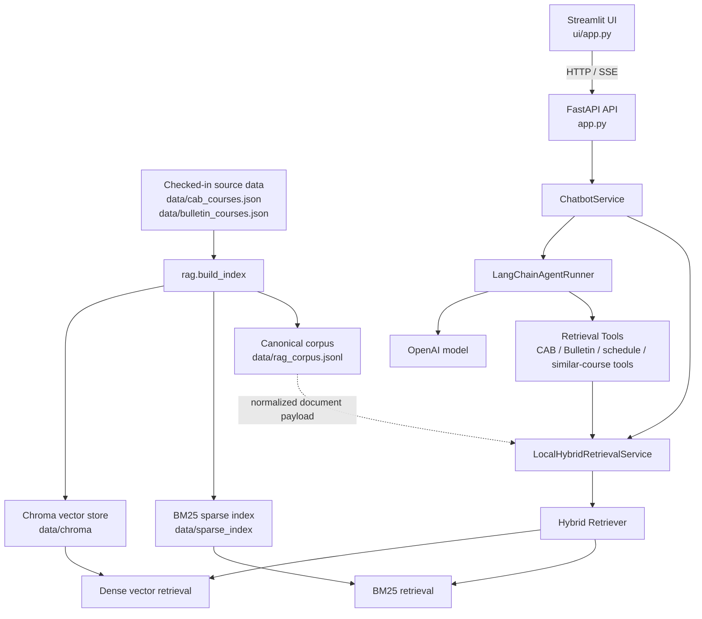

# Impiricus Take-Home

This repository contains a local-first course-search stack:

- FastAPI backend in [app.py](/Users/shawn.n/github_repos/impiricus-take-home/app.py)
- hybrid retrieval (`Chroma` + `BM25`) in [rag](/Users/shawn.n/github_repos/impiricus-take-home/rag)
- Streamlit UI in [ui/app.py](/Users/shawn.n/github_repos/impiricus-take-home/ui/app.py)
- source course data in [data](/Users/shawn.n/github_repos/impiricus-take-home/data)

The important local setup detail is that the source JSON data is already checked into the repo. After cloning, you do not need to re-run the CAB or Bulletin scrapers just to get the app running. You do still need to install dependencies and build the local retrieval artifacts (the sparse index and Chroma vector store).

## Local Setup

### 1. Create a virtual environment

```bash
python3 -m venv .venv
source .venv/bin/activate
```

### 2. Install dependencies

```bash
pip install -r requirements.txt
```

`playwright` is included in `requirements.txt`, but you only need to run `python -m playwright install chromium` if you plan to re-run the CAB scraper. It is not required for normal local app setup.

### 3. Add environment variables

Create a `.env` file in the repo root:

```bash
OPENAI_API_KEY=your_key_here
```

`OPENAI_API_KEY` is required for the chatbot API (`/query` and `/evaluate`) and for the Streamlit UI. The app loads `.env` automatically when `python-dotenv` is installed.

Optional overrides:

- `RAG_PERSIST_DIR` (defaults to `data`)
- `RAG_EMBEDDING_MODEL` (defaults to `mixedbread-ai/mxbai-embed-large-v1`)
- `RAG_CHROMA_COLLECTION` (defaults to `courses`)
- `CHATBOT_API_BASE_URL` for the Streamlit app (defaults to `http://localhost:8000`)

### 4. Build the local retrieval artifacts

The checked-in data files:

- [data/cab_courses.json](/Users/shawn.n/github_repos/impiricus-take-home/data/cab_courses.json)
- [data/bulletin_courses.json](/Users/shawn.n/github_repos/impiricus-take-home/data/bulletin_courses.json)

are the inputs for indexing. Build the local indices with:

```bash
python3 -m rag.build_index --persist-dir data --log-level INFO
```

This step:

- reads the existing CAB and Bulletin JSON files
- writes [data/rag_corpus.jsonl](/Users/shawn.n/github_repos/impiricus-take-home/data/rag_corpus.jsonl)
- creates `data/sparse_index/`
- creates `data/chroma/`

On the first run, `sentence-transformers` may download the embedding model weights into your local cache. That is expected.

If you change the source JSON and want to regenerate everything from scratch, run:

```bash
python3 -m rag.build_index --persist-dir data --rebuild true --log-level INFO
```

## Run Locally

### Start the API

```bash
uvicorn app:app --reload
```

The API will be available at `http://localhost:8000`.

Useful endpoints:

- `GET /health` for a simple liveness check
- `POST /query` for the streaming chatbot response (SSE)
- `POST /evaluate` for a synchronous diagnostics response

Example request body:

```json
{
  "q": "What are some machine learning courses?",
  "department": "CSCI"
}
```

### Start the Streamlit UI

In a second terminal, with the same virtual environment activated:

```bash
streamlit run ui/app.py
```

By default, the UI talks to `http://localhost:8000`. If your API is running somewhere else, set `CHATBOT_API_BASE_URL` before starting Streamlit.

## System Architecture



### Architecture Description

The system has two main phases:

1. Offline indexing: [rag/build_index.py](/Users/shawn.n/github_repos/impiricus-take-home/rag/build_index.py) reads the checked-in CAB and Bulletin JSON files, normalizes them into one canonical corpus, then builds a BM25 sparse index in `data/sparse_index/` and a Chroma vector index in `data/chroma/`.
2. Online query serving: the Streamlit frontend sends a request to the FastAPI app, which loads the persisted retrieval artifacts, performs a deterministic retrieval pass, and then uses the LangChain-based agent to generate a grounded response using retrieval tools plus the OpenAI model.

At query time, the retrieval layer combines keyword matching and semantic matching:

- sparse retrieval is useful for exact terms like course codes, department names, and schedule-related phrasing
- dense retrieval is useful for semantic similarity and looser natural-language queries
- the hybrid retriever fuses both ranked lists before the chatbot answers

The backend is stateless between requests. Data and retrieval artifacts are persisted on disk, but conversation memory is not stored server-side.

## Test

Run the test suite with:

```bash
pytest -q
```

## Example Queries

Use these in the Streamlit UI or as the `q` field for `POST /query`:

1. `Who teaches APMA2680, and when does the class meet?`
2. `I am interested in Philosophy courses related to metaphysics. Which ones do you recommend?`
3. `Find a Brown Bulletin course similar to CSCI0320 from CAB.`
4. `List all CAB courses taught on Fridays after 3 pm related to "machine learning."`

## Design Decisions and Tradeoffs

- Checked-in source JSON for local setup: keeping [data/cab_courses.json](/Users/shawn.n/github_repos/impiricus-take-home/data/cab_courses.json) and [data/bulletin_courses.json](/Users/shawn.n/github_repos/impiricus-take-home/data/bulletin_courses.json) in the repo makes first-time setup much faster and more reliable, but it means the data can become stale unless someone explicitly refreshes it.
- Local index build instead of precommitted vector artifacts: users do not need to scrape, but they still rebuild `data/sparse_index/` and `data/chroma/` locally. This avoids checking large or machine-specific vector artifacts into Git, at the cost of a slower first run and an embedding-model download.
- Hybrid retrieval instead of dense-only search: combining BM25 and vector search improves robustness across exact lookup queries and semantic questions, but it adds more moving parts than a single retrieval method.
- Chroma for local persistence: Chroma is easy to run locally with no separate service dependency, which keeps setup simple, but it is not the same operational model you would necessarily choose for a larger production deployment.
- Stateless API design: each request is independent, which keeps the backend simple and predictable, but the app does not preserve conversation context across turns.
- SSE streaming for `/query`: streaming improves perceived responsiveness in the UI, but it makes the frontend integration slightly more complex than a plain JSON response.
- OpenAI for answer generation with local retrieval grounding: the retrieval stack runs locally and keeps the search corpus on disk, while generation is delegated to an external model. This improves answer quality and keeps the implementation practical, but it introduces an API-key dependency and external network reliance for final response generation.

## Adding Additional Datasets

The current index builder accepts two input files:

- `--cab` for CAB-shaped records
- `--bulletin` for Bulletin-shaped records

That means there are two supported ways to add more data.

### Option 1: Add a replacement or merged dataset without code changes

If your new dataset can be represented in the existing schema, create a JSON file containing a top-level array of records and point the index builder at it with `--cab` or `--bulletin`.

Required fields for the existing normalization path:

- `source`: string such as `cab`, `bulletin`, or another source label
- `course_code`: string
- `title`: string

Optional fields:

- `description`: string
- `prerequisites`: string
- `department`: string
- `meetings`: list of strings
- `instructor`: list of objects with a `name` field
- `course_url`: string

Example record:

```json
{
  "source": "extension_catalog",
  "course_code": "DATA 1010",
  "title": "Applied Data Practice",
  "description": "Hands-on introduction to applied analytics.",
  "prerequisites": "Intro statistics.",
  "department": "DATA",
  "meetings": ["TTh 3:00-4:20 PM"],
  "instructor": [
    { "name": "Jordan Lee" }
  ],
  "course_url": "https://example.edu/courses/data-1010"
}
```

Then build with custom input paths. For example:

```bash
python3 -m rag.build_index \
  --cab data/my_additional_cab_like_dataset.json \
  --bulletin data/bulletin_courses.json \
  --persist-dir data \
  --rebuild true \
  --log-level INFO
```

Or, if the new dataset is closer to the Bulletin shape:

```bash
python3 -m rag.build_index \
  --cab data/cab_courses.json \
  --bulletin data/my_additional_bulletin_like_dataset.json \
  --persist-dir data \
  --rebuild true \
  --log-level INFO
```

This approach is the fastest path, but it means your new file is being treated as one of the two existing input slots.

### Option 2: Add a true third source with code changes

If you want to keep CAB, keep Bulletin, and also index a third dataset as its own source, update the indexing pipeline:

1. Add an extractor or transform that produces records in the same general shape described above.
2. Extend [rag/indexing/build_index.py](/Users/shawn.n/github_repos/impiricus-take-home/rag/indexing/build_index.py) to accept an additional CLI argument for the new file.
3. Extend [rag/indexing/normalize.py](/Users/shawn.n/github_repos/impiricus-take-home/rag/indexing/normalize.py) so the new source is loaded and normalized into `CanonicalCourseDocument` records.
4. Rebuild the indices with `python3 -m rag.build_index --rebuild true`.

The key rule is that every source must end up as canonical documents with:

- stable `doc_id`
- normalized `source` and `source_label`
- retrieval text in the `text` field
- flat metadata that can be stored in Chroma

If the new source is missing fields like meetings or instructors, follow the Bulletin pattern and fill those with neutral defaults (`[]` or `None`) before normalization.

## Notes

- Fresh clones already contain the source course data in `data/`; you do not need to scrape again for normal development.
- Fresh clones do not necessarily contain the built retrieval indices, so `python3 -m rag.build_index ...` should be part of first-time setup.
- If `data/sparse_index/` or `data/chroma/` are missing, the API will return a `503` until you build the indices.
- If `OPENAI_API_KEY` is missing, the chatbot endpoints will return a `503`.

## Optional: Rebuild Source Data

Only do this if you intentionally want to refresh the checked-in source JSON files. It is not part of the normal local setup flow.

- CAB scraping code lives under [etl/cab_scraper_1](/Users/shawn.n/github_repos/impiricus-take-home/etl/cab_scraper_1) and [etl/cab_scraper_2](/Users/shawn.n/github_repos/impiricus-take-home/etl/cab_scraper_2)
- Bulletin extraction code lives under [etl/bulletin_scraper](/Users/shawn.n/github_repos/impiricus-take-home/etl/bulletin_scraper)

If you go down that path, install the browser dependency first:

```bash
python -m playwright install chromium
```
